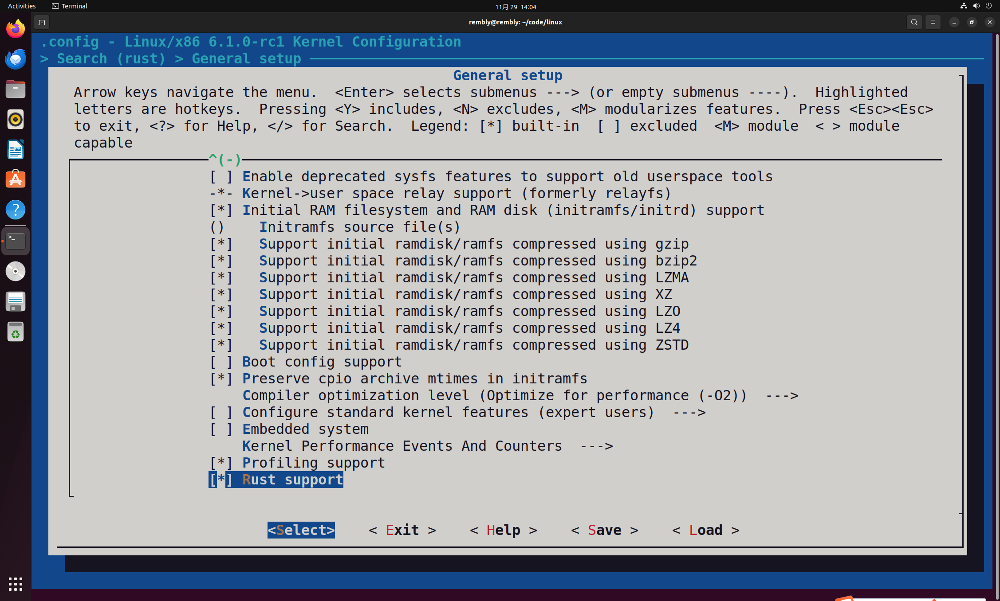
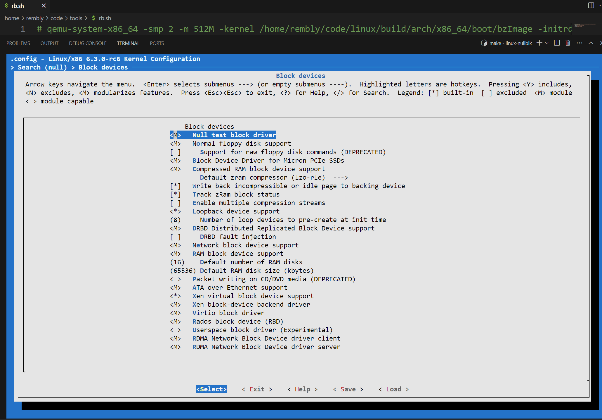
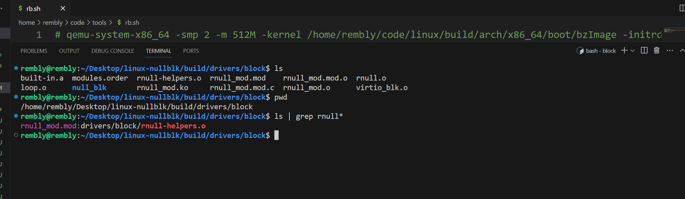
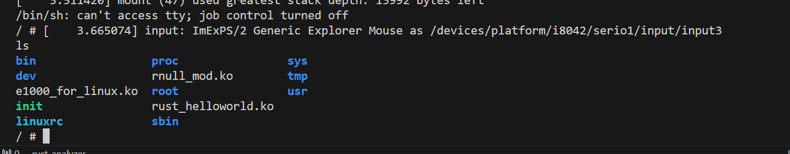
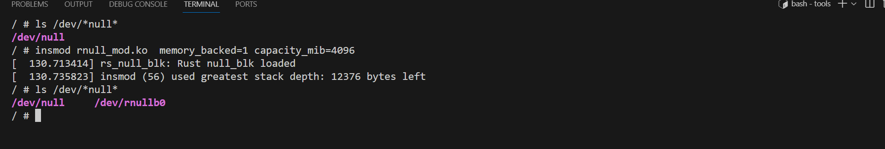
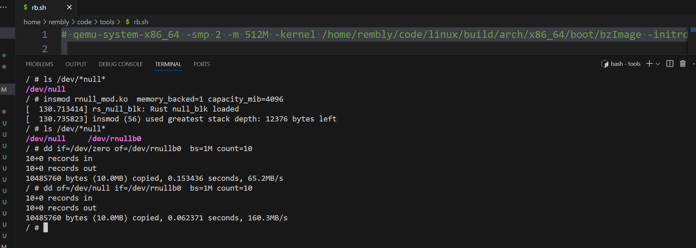

##Null块驱动复现与代码分析

###Null块介绍
Null block（空块）通常是指一种虚拟块设备，它本身不存储任何数据，而是在内存中模拟块设备的行为。Null block 设备通常用于测试、调试和模拟的目的。在内核开发中，Null block 设备可以用来替代真实的块设备，以便在不依赖于物理存储设备的情况下测试和验证块设备的相关功能。
###驱动复现
####1 源码下载
```
git clone https://github.com/metaspace/linux.git -b null_block_RFC
```
####2 环境配置
系统环境配置
```
sudo apt-get -y install \
  binutils build-essential libtool texinfo \
  gzip zip unzip patchutils curl git \
  make cmake ninja-build automake bison flex gperf \
  grep sed gawk bc \
  zlib1g-dev libexpat1-dev libmpc-dev \
  libglib2.0-dev libfdt-dev libpixman-1-dev libelf-dev libssl-dev

  sudo apt-get install clang-format clang-tidy clang-tools clang \
  clangd libc++-dev libc++1 libc++abi-dev libc++abi1 libclang-dev libclang1 \
   liblldb-dev libllvm-ocaml-dev libomp-dev libomp5 lld \
   lldb llvm-dev llvm-runtime llvm python3-clang
```
####3 rust环境配置
首先进入源码目录
```
cd /path/to/linux
```
配置rust环境
```
rustup override set $(scripts/min-tool-version.sh rustc)
rustup component add rust-src
cargo install --locked --version $(scripts/min-tool-version.sh bindgen) bindgen
```
检查环境是否配正确
```
make LLVM=1 rustavailable
```
如果输出Rust is available则配置成功

####4 编译内核
编译前配置,如果使用的非x86平台，需要添加ARCH=XXX    。
```
make LLVM=1 O=build defconfig

make LLVM=1 O=build menuconfig
```
开启Rust Support

选择Rust null block将其编译为模块

编译内核
```
make LLVM=1 -j16
```
可以发现rnull模块已经被编译完成


####5 使用busybox制作根文件系统

下载并解压
```
wget https://busybox.net/downloads/busybox-1.35.0.tar.bz2
tar -xf busybox-1.35.0.tar.bz2
cd busybox-1.35.0
```
配置参数选择静态编译
```
make menuconfig
```

编译
```
make -j16
```

安装
```
make install
```
创建必要目录
```
cd _install
mkdir proc sys dev tmp
touch init
chmod +x init
```
编辑init
```
#!/bin/sh

# 挂载一些必要的文件系统
mount -t proc none /proc
mount -t sysfs none /sys
mount -t tmpfs none /tmp
mount -t devtmpfs none /dev


# 停留在控制台
exec /bin/sh
```
制作initrd文件
```
# _install目录
find . -print0 | cpio --null -ov --format=newc | gzip -9 > ../initramfs.cpio.gz
```
这里为了方便往根文件系统中添加文件可以制作一个makefs.sh脚本文件
```
cd rootfs
find . -print0 | cpio --null -ov --format=newc | gzip -9 > ../initramfs.cpio.gz
cd ..
```

####6 运行-测试
将null驱动文件复制到根文件系统，运行qemu
```
qemu-system-x86_64 \
-kernel /home/rembly/Desktop/linux-nullblk/build/arch/x86/boot/bzImage \
-append "init=/init console=ttyS0" \
-nographic \
-initrd initramfs.cpio.gz
```
可以看到rnull_mod.ko。


加载rnull驱动，可以看到/dev下面增加了/dev/rnullb0。


最后对rnull块进行读写操作。
先进行写测试，向rnull块写入0。

```
dd if=/dev/zero of=/dev/rnullb0 bs=1M count=10

```
再进行读测试，将rnullb0中的内容读取并写去null块内。
```
dd of=/dev/null if=/dev/rnullb0 bs=1M count=10

```



经过测试，rnull驱动能够进行基本的读写操作。

###源代码分析
在这份驱动实现中，通过创建一个 NullBlkModule 模块和相关的 NullBlkDevice 结构体，以及使用 RadixTree 等数据结构，实现了一个简单的 Null block 驱动模块。这个模块在内核加载时创建了一个虚拟的块设备，并且通过模拟页面管理实现了读写等基本块设备操作。
####1 参数配置
```rust
module! {
    type: NullBlkModule,
    name: "rs_null_blk",
    author: "Andreas Hindborg",
    license: "GPL v2",
    params: {
        memory_backed: bool {
            default: true,
            permissions: 0,
            description: "Use memory backing",
        },
        capacity_mib: u64 {
            default: 4096,
            permissions: 0,
            description: "Device capacity in MiB",
        },
    },
}
```
这段代码用于定义定义内核模块的元信息和参数。类型是NullBlkModule，驱动名称是rs_null_blk，有两个加载模块时可选的参数，memory_backed和capacity_mib，memory_backed参数用于指定是否使用内存支持，，默认为true使用内存，而capacity_mib 设置null块的容量，默认4096，单位是MB。
我们在加载驱动时可以使用这两个参数：

```sh
insmod rs_null_blk.ko memory_backed=1 capacity_mib=4096
```

####2 模块加载与卸载

```rust
struct NullBlkModule {
    _disk: Pin<Box<Mutex<GenDisk<NullBlkDevice>>>>,
}
impl kernel::Module for NullBlkModule {
    fn init(_module: &'static ThisModule) -> Result<Self> {
        pr_info!("Rust null_blk loaded\n");
        // Major device number?
        let tagset = TagSet::try_new(1, (), 256, 1)?;
        let disk = Box::pin_init(new_mutex!(add_disk(tagset)?, "nullb:disk"))?;

        disk.lock().add()?;

        Ok(Self { _disk: disk })
    }
}

impl Drop for NullBlkModule {
    fn drop(&mut self) {
        pr_info!("Dropping rnullb\n");
    }
}
```
接下来定义了模块的结构体NullBlkModule，其实现了kernel::Module特性，说明这是一个内核模块结构体，包含一个 GenDisk<NullBlkDevice> 的互斥锁，确保对虚拟块设备的关键操作是互斥的，以防止并发访问导致的竞态条件。因为null块很可能被并发的访问，所以必须保证对其操作的原子性。init在模块加载时被调用，Drop在模块卸载是调用，仅仅打印一条简单的输出。

####3 初始化并创建null块设备

```rust 
fn add_disk(tagset: Arc<TagSet<NullBlkDevice>>) -> Result<GenDisk<NullBlkDevice>> {
    let tree = RadixTree::new()?;
    let queue_data = Box::pin_init(new_spinlock!(tree, "rnullb:mem"))?;

    let disk = GenDisk::try_new(tagset, queue_data)?;
    disk.set_name(format_args!("rnullb{}", 0))?;
    disk.set_capacity(*capacity_mib.read() << 11);
    disk.set_queue_logical_block_size(4096);
    disk.set_queue_physical_block_size(4096);
    disk.set_rotational(false);
    Ok(disk)
}
```
add_disk函数用于初始化并创建null块设备，首先创建了一个新的 RadixTree，用于存储设备数据。通过 new_spinlock! 宏创建了一个名为 queue_data 的自旋锁，用于对设备队列的保护。将tagset, queue_data作为参数传入GenDisk::try_new 函数创建了一个虚拟块设备对象 disk。接下来设置disk设置的基本属性，包括名称、容量、逻辑块大小、物理块大小等。最后返回初始化后的虚拟块设备对象。


####4 Null块设备

```rust
struct NullBlkDevice;
type Tree = kernel::radix_tree::RadixTree<Box<Pages<0>>>;
type Data = Pin<Box<SpinLock<Tree>>>;

impl NullBlkDevice {
    #[inline(always)]
    fn write(tree: &mut Tree, sector: usize, segment: &Segment<'_>) -> Result {
        let idx = sector >> 3; // TODO: PAGE_SECTOR_SHIFT
        let mut page = if let Some(page) = tree.get_mut(idx as u64) {
            page
        } else {
            tree.try_insert(idx as u64, Box::try_new(Pages::new()?)?)?;
            tree.get_mut(idx as u64).unwrap()
        };

        segment.copy_to_page_atomic(&mut page)?;

        Ok(())
    }

    #[inline(always)]
    fn read(tree: &mut Tree, sector: usize, segment: &mut Segment<'_>) -> Result {
        let idx = sector >> 3; // TODO: PAGE_SECTOR_SHIFT
        if let Some(page) = tree.get(idx as u64) {
            segment.copy_from_page_atomic(page)?;
        }

        Ok(())
    }

    #[inline(never)]
    fn transfer(
        command: bindings::req_op,
        tree: &mut Tree,
        sector: usize,
        segment: &mut Segment<'_>,
    ) -> Result {
        match command {
            bindings::req_op_REQ_OP_WRITE => Self::write(tree, sector, segment)?,
            bindings::req_op_REQ_OP_READ => Self::read(tree, sector, segment)?,
            _ => (),
        }
        Ok(())
    }
}

```
struct NullBlkDevice;：定义了一个空的结构体 NullBlkDevice，用于表示Null块设备。type Tree和type Data用于存储块设备内的数据。定义了块设备的基本读写方法read和write。然后通过transfer方法根据传入的参数类型来决定调用是read操作还是write操作
1，write方法：
参数1：tree，&mut Tree类型，是用于存储数据的树形数据结构。
参数2：sector，usize类型，表示要写入的扇区的索引。
参数3：segment，&Segment<'_>类型，表示要写入的数据段。
返回值：Result，写入是否成功。
代码分析：计算扇区号对应的页索引idx,尝试从 tree 中获取对应页，如果不存在则插入一个新的页page。调用copy_to_page_atomic将segment中的数据复制到页面。返回结果。
2， read方法：
参数1：tree，&mut Tree类型，是用于存储数据的树形数据结构。
参数2：sector，usize类型，表示要写入的扇区的索引。
参数3：segment，&Segment<'_>类型，表示要写入的数据段。
返回值：Result，读取是否成功。
代码分析：计算扇区号对应的页索引idx，如果索引的page存在则将其复制，返回结果。
3， transfer：
参数1: command, bindings::req_op类型，据此来调用读写操作。
参数2：tree，&mut Tree类型，是用于存储数据的树形数据结构。
参数3：sector，usize类型，表示要写入的扇区的索引。
参数4：segment，&Segment<'_>类型，表示要写入的数据段。
返回值：Result，读取是否成功。
代码分析：根据请求类型调用相应的读或写函数。

####5 null块操作集合
```rust
#[vtable]
impl Operations for NullBlkDevice {
    type RequestData = ();
    type QueueData = Data;
    type HwData = ();
    type TagSetData = ();

    fn new_request_data(
        _tagset_data: <Self::TagSetData as ForeignOwnable>::Borrowed<'_>,
    ) -> Result<Self::RequestData> {
        Ok(())
    }

    #[inline(always)]
    fn queue_rq(
        _hw_data: <Self::HwData as ForeignOwnable>::Borrowed<'_>,
        queue_data: <Self::QueueData as ForeignOwnable>::Borrowed<'_>,
        rq: &mq::Request<Self>,
        _is_last: bool,
    ) -> Result {
        rq.start();
        if *memory_backed.read() {
            let mut tree = queue_data.lock_irqsave();

            let mut sector = rq.sector();
            for bio in rq.bio_iter() {
                for mut segment in bio.segment_iter() {
                    let _ = Self::transfer(rq.command(), &mut tree, sector, &mut segment);
                    sector += segment.len() >> 9; // TODO: SECTOR_SHIFT
                }
            }
        }
        rq.end_ok();
        Ok(())
    }

    fn commit_rqs(
        _hw_data: <Self::HwData as ForeignOwnable>::Borrowed<'_>,
        _queue_data: <Self::QueueData as ForeignOwnable>::Borrowed<'_>,
    ) {
    }

    fn complete(_rq: &mq::Request<Self>) {
        //rq.end_ok();
    }

    fn init_hctx(
        _tagset_data: <Self::TagSetData as ForeignOwnable>::Borrowed<'_>,
        _hctx_idx: u32,
    ) -> Result<Self::HwData> {
        Ok(())
    }
}
```
这段代码定义了用于null块设备的基本的操作集合，定义了设备的行为。
1. new_request_data 方法用于创建新的请求数据对象。在这里，它只是返回一个空的 Result，表示请求数据对象的创建成功。
2. queue_rq 方法处理将请求添加到队列。在这里调用 rq.start() 开始处理请求。使用memory_backed 标志检查是否支持内存备份。如果支持内存备份，获取队列数据的锁，然后遍历请求的bio和其包含的segment。调用 Self::transfer 方法，根据段的长度更新扇区号,用于在内存中进行读写操作。调用 rq.end_ok() 表示请求处理完成。
3. commit_rqs 方法用于提交处理过的请求。在这里，它是一个空实现，没有具体的操作。
4. complete 方法用于处理请求的完成。在这里，它也是一个空实现，没有具体的操作。
5. init_hctx 方法用于初始化硬件上下文。在这里，它只是返回一个空的 Result，表示初始化成功。

